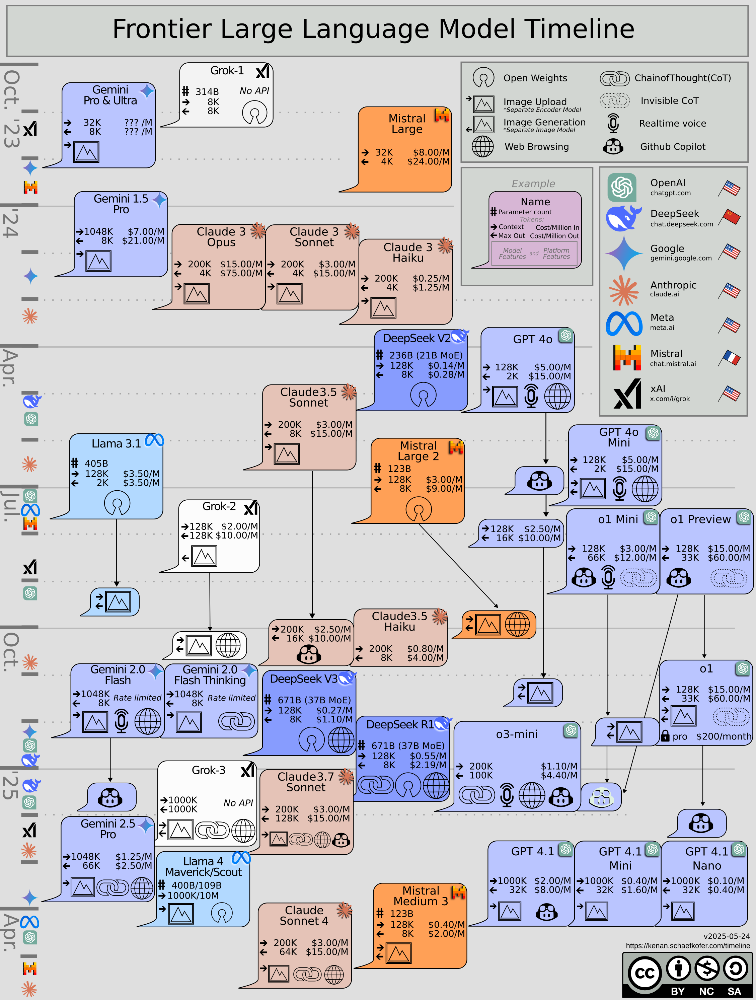

# Frontier LLM Timeline

When frontier large language models existed and were available, and where they came from.

- `data/` — curated dataset (one YAML file per lab); see `data/SCHEMA.md`
- `scripts/` — validation, link checking, and the build into `site/data.json`
- `site/` — the generated interactive timeline
- `archive/` — the original hand-drawn timeline (2023 – May 2025)
- `PLAN.md` — roadmap for the interactive lineage timeline

<a property="dct:title" rel="cc:attributionURL" href="https://kenan.schaefkofer.com/timeline">Frontier LLM Timeline</a> by <a rel="cc:attributionURL dct:creator" property="cc:attributionName" href="https://kenan.schaefkofer.com">Kenan Schaefkofer</a> is licensed under <a href="https://creativecommons.org/licenses/by-nc-sa/4.0/?ref=chooser-v1" target="_blank" rel="license noopener noreferrer" style="display:inline-block;">CC BY-NC-SA 4.0</a>
 
